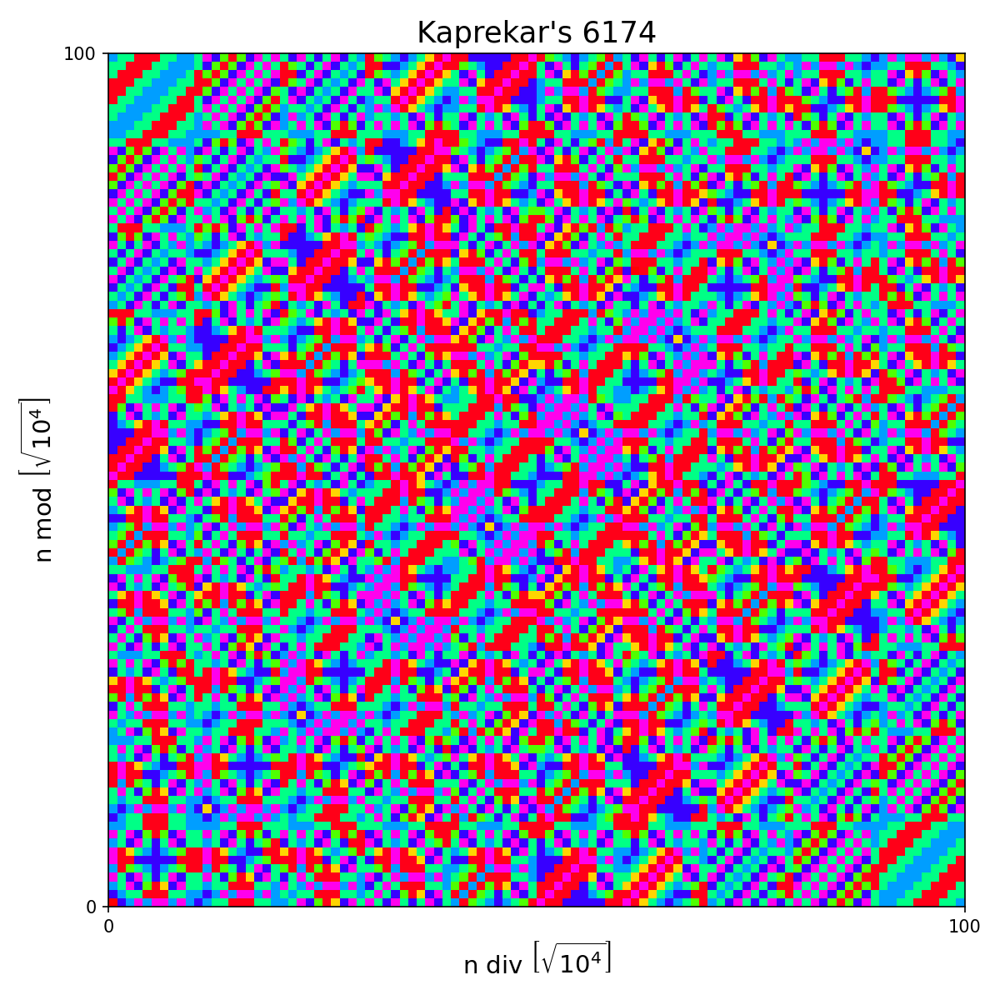

# KAPREKAR'S 6174

In 1949, [D. R. Kaprekar](https://en.wikipedia.org/wiki/D._R._Kaprekar) discovered a procedure, now known as the [Kaprekar routine](https://en.wikipedia.org/wiki/Kaprekar%27s_routine), which takes a 4-decimal-digit number (with at least two distinct digits) to the number 6174 in at most 7 steps of his procedure. Applying this procedure to 6174 produces 6174. Numbers of the form $dddd$ all go to 0 in one step.

First step of the routine is to choose any positive $k$-digit integer $n_1$. If $n_1$ has fewer than $k$ digits, then take the leading digits to be 0 (i.e, consider 0s padded to $n_1$ where they don’t matter). Two integers ${n'}_1$ and ${n''}_1$ can be formed out of the $k$ digits of $n_1$; namely, by sorting the digits in ascending and descending orders. To get the next number $n_2$ in this sequence, take the difference of ${n'}_1$ and ${n''}_1$. That is, $n_2 = max({n'}_1, {n''}_1) − min({n'}_1, {n''}_1)$. Now apply the same routine to $n_2$ to get $n_3$, and so on. Any positive integer base other than 10 can also be used. A variant of the routine omits the zero-padding step above. Depending on $k$ and $b$, the two variants may show different behaviours.

In the figure, each colored box represents the number of steps required for the Kaprekar routine to reach a fixed point (0 or 6174) starting from integers $n$ = 0, ..., 9999. The axes are related to $n$, the base ($b$ = 10), and the number of digits ($k$ = 4). $"a$ div $b"$ represents the integer division of $a$ by $b$,  $"a$ mod $b"$ stands for the integer remainder after integer division of $a$ by $b$, and $[x]$ means the smallest integer greater than or equal to $x$.

One goal of this exercise is to produce a plot similar to the one above. Another goal is to computationally characterize the cyclic patterns produced by the Kaprekar routine. For example, 4-digits integers produce two distinct cyclic patterns: 0000 (integers of the form $dddd$) and 6174 (all other integers). Both these cycles have period = 1. The 2-digit numbers produce two distinct cyclic patterns: period-1 cycle 00 (integers of form $dd$), and the period-5 cycle 09, 81, 63, 27, 45 (all other integers). Fix the base $b$ (say, $b = 10$), and the number of digits $k$ (say, $k = 4$). Run the Kaprekar routine for each integer between 0 and $b^k$ − 1. Assume that this routine produces, starting from any integer, a sequence of numbers that eventually rolls into a cyclic pattern. Find out how many distinct cyclic patterns are produced for the given combination of $b$ and $k$.
